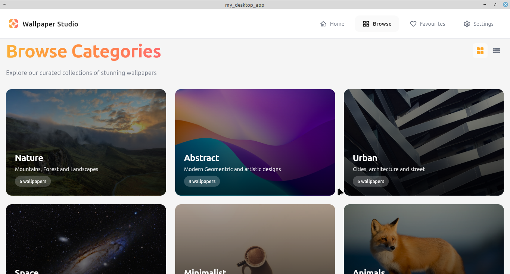

# Wallpaper Studio - Desktop Application

A beautiful and intuitive desktop wallpaper selector application built with Flutter for HNG Mobile Track Stage 3.

## 📸 Screenshots



## ✨ Features

- **Browse Categories**: Explore curated wallpaper collections across 6 categories (Nature, Abstract, Urban, Space, Minimalist, Animals)
- **Active Wallpaper Display**: View your currently active wallpaper on the home screen
- **Wallpaper Preview**: Full-screen preview with phone mockup visualization
- **Favorites System**: Save your favorite wallpapers for quick access
- **Wallpaper Setup**: Configure display modes (Fit, Fill, Stretch, Tile)
- **Settings Management**: Customize image quality, notifications, and advanced settings
- **Grid & List Views**: Toggle between different browsing layouts
- **Responsive Design**: Optimized for desktop screen sizes
- **Error Handling**: Graceful fallback for missing images

## 🛠️ Technologies Used

- **Flutter SDK** (3.0.0+)
- **Provider** - State management
- **Shared Preferences** - Local data persistence
- **Dart** - Programming language

## 📋 Prerequisites

Before you begin, ensure you have the following installed:

- Flutter SDK (3.0.0 or higher)
- Dart SDK
- Linux desktop development dependencies:
  ```bash
  sudo apt-get install clang cmake ninja-build pkg-config libgtk-3-dev liblzma-dev
  ```

## 🚀 Installation & Setup

### 1. Clone the Repository

```bash
git clone <your-repository-url>
cd wallpaper_studio
```

### 2. Install Dependencies

```bash
flutter pub get
```

### 3. Enable Linux Desktop Support

```bash
flutter config --enable-linux-desktop
flutter doctor
```

### 4. Create Assets Folder Structure

**Option A: Using Python (Recommended)**

```bash
# Make sure you have Python 3 installed
python3 create_placeholder_assets.py

# If you want actual placeholder images (optional):
pip install Pillow
python3 create_placeholder_assets.py
```

**Option B: Using Bash Script**

```bash
chmod +x create_placeholder_assets.sh
./create_placeholder_assets.sh
```

**Option C: Manual Creation**

```bash
mkdir -p assets/images/categories/{nature,abstract,urban,space,minimalist,animals}
mkdir -p assets/icons
```

### 5. Add Your Wallpaper Images

Replace the placeholder images with actual wallpapers following this structure:

```
assets/images/categories/
├── nature/
│   ├── nature1.jpg
│   ├── nature2.jpg
│   ├── nature3.jpg
│   ├── nature4.jpg
│   ├── nature5.jpg
│   └── nature6.jpg
├── abstract/
│   ├── abstract1.jpg
│   ├── abstract2.jpg
│   ├── abstract3.jpg
│   └── abstract4.jpg
├── urban/
│   ├── urban1.jpg (through urban6.jpg)
├── space/
│   ├── space1.jpg (through space3.jpg)
├── minimalist/
│   ├── minimalist1.jpg (through minimalist6.jpg)
└── animals/
    ├── animals1.jpg (through animals4.jpg)
```

**Image Specifications:**

- Format: JPG or PNG
- Recommended dimensions: 1080x1920 (portrait) or 1920x1080 (landscape)
- Quality: High resolution for best display

**Note:** The app includes error handling and will show placeholders if images are missing, so it will run even without actual images.

## 🏃 Running the Application

### Development Mode

```bash
flutter run -d linux
```

### Build Release Version

```bash
flutter build linux --release
```

The executable will be located at:

```
build/linux/x64/release/bundle/wallpaper_studio
```

### Running the Release Build

```bash
cd build/linux/x64/release/bundle/
./wallpaper_studio
```

## 📦 Project Structure

```
my_desktop_app/
├── lib/
│   ├── main.dart                      # App entry point
│   ├── models/
│   │   ├── category.dart              # Category data model
│   │   └── wallpaper.dart             # Wallpaper data model
│   ├── providers/
│   │   ├── wallpaper_provider.dart    # Wallpaper state management
│   │   └── favorites_provider.dart    # Favorites state management
│   ├── screens/
│   │   ├── home_screen.dart           # Home page with categories
│   │   ├── browse_screen.dart         # Browse all categories
│   │   ├── category_detail_screen.dart # Category wallpapers view
│   │   ├── wallpaper_detail_screen.dart # Wallpaper preview
│   │   ├── favorites_screen.dart      # Saved wallpapers
│   │   └── settings_screen.dart       # App settings
│   ├── widgets/
│   │   ├── navigation_bar.dart        # Top navigation bar
│   │   ├── category_card.dart         # Category card component
│   │   ├── wallpaper_card.dart        # Wallpaper card component
│   │   ├── active_wallpaper_card.dart # Active wallpaper display
│   │   ├── preview_phone_widget.dart  # Phone mockup preview
│   │   ├── wallpaper_setup_modal.dart # Setup modal dialog
│   │   └── safe_image.dart            # Image with error handling
│   └── utils/
│       ├── colors.dart                # App color constants
│       ├── constants.dart             # App constants
│       └── dummy_data.dart            # Sample wallpaper data
├── assets/
│   ├── images/
│   └── icons/
├── linux/                              # Linux-specific files
├── create_placeholder_assets.py        # Python asset generator // this is optional
├── create_placeholder_assets.sh        # Bash asset generator // this is optional
├── pubspec.yaml                        # Dependencies
└── README.md                           # This file
```

## 🎨 Design Implementation

This application is a **pixel-perfect** implementation of the Figma design provided for HNG Mobile Track Stage 3. All screens match the original design specifications including:

### Design Specifications:

- **Primary Colors**:
  - Orange: #FFA726, #FF8C42
  - Gradient: #FBB03B → #FF8C42 → #FF6B6B
- **Background**: #F5F5F5, #FAFAFA
- **Text Colors**:
  - Dark: #1A1A1A
  - Gray: #6B7280
  - Light: #9CA3AF
- **Typography**:
  - Font Family: Poppins and Clash Display (system default fallback)
  - Weights: 400 (Regular), 600 (Semi-bold), 700 (Bold)
- **Spacing**: 8px, 16px, 24px, 32px
- **Border Radius**: 12px, 16px, 20px, 40px
- **Shadows**: Subtle elevation with opacity 0.04-0.15

### Implemented Screens:

1. ✅ Home Screen (with/without Active Wallpaper card)
2. ✅ Browse Categories (Grid view)
3. ✅ Browse Categories (List view)
4. ✅ Category Detail with Wallpaper Grid
5. ✅ Wallpaper Detail with Preview Panel
6. ✅ Wallpaper Setup Modal
7. ✅ Favorites (with wallpapers)
8. ✅ Favorites (empty state)
9. ✅ Settings Screen

## 📱 Features Breakdown

### Home Screen

- Gradient header: "Discover Beautiful Wallpapers"
- Descriptive subtitle
- Active wallpaper card (when wallpaper is set)
- Categories grid (3x2 layout)
- "See All" navigation link

### Browse Screen

- Grid/List view toggle
- All 6 categories displayed
- Consistent card styling
- Click to view category details

### Category Detail Screen

- Back navigation button
- Category title with view toggle
- Wallpaper grid (3 columns)
- Favorite button on each wallpaper
- Click to view wallpaper details

### Wallpaper Detail Screen

- **Left Panel**: Wallpaper grid from category
- **Right Panel**:
  - Phone mockup preview
  - Wallpaper information (name, tags, description)
  - Save to favorites button
  - Share and settings icons
  - Set as wallpaper button (primary action)

### Favorites Screen

- Grid of saved wallpapers (3 columns)
- Heart icons (filled orange)
- Empty state:
  - Icon illustration
  - "No Saved Wallpapers" message
  - "Browse Wallpapers" CTA button

### Settings Screen

- **Left Panel**:
  - Image quality dropdown
  - Notification toggle
  - Save/Cancel buttons
- **Right Panel**:
  - Phone mockup
  - Device connection status

## 🔧 Configuration

### Adding New Categories

Edit `lib/utils/dummy_data.dart`:

```dart
Category(
  id: '7',
  name: 'Your Category',
  description: 'Category description',
  wallpaperCount: 5,
  thumbnail: 'assets/images/categories/your_category/your_category1.jpg',
),
```

### Adding New Wallpapers

Edit `lib/utils/dummy_data.dart`:

```dart
Wallpaper(
  id: 'your_id',
  name: 'Wallpaper Name',
  imageUrl: 'assets/images/categories/category/image.jpg',
  category: 'Category Name',
  tags: ['Tag1', 'Tag2'],
  description: 'Wallpaper description',
),
```

## 🐛 Troubleshooting

### Images Not Loading

- Verify folder structure matches requirements
- Check image file names (case-sensitive)
- Run `flutter clean` and `flutter pub get`
- The app will show placeholders for missing images

### Build Errors

```bash
# Clean build artifacts
flutter clean

# Get dependencies
flutter pub get

# Verify Flutter installation
flutter doctor -v
```

### Linux Desktop Not Available

```bash
# Enable Linux desktop support
flutter config --enable-linux-desktop

# Install required libraries
sudo apt-get install clang cmake ninja-build pkg-config libgtk-3-dev liblzma-dev
```

## 🔗 Links

- **GitHub Repository**: [Your GitHub Repo URL]
- **Demo Video**: [Your Demo Video Link - Google Drive/Loom/Dropbox]
- **Release Build**: [Direct download link to executable]
- **Figma Design**: https://www.figma.com/design/WnHFPfZ7uW2vxy4sHqtb12/MOBILE-WALLPAPER-SELECTOR

## 📝 Submission Checklist

- [ ] All screens implemented from Figma design
- [ ] UI is pixel-perfect (fonts, colors, spacing, alignment)
- [ ] All navigation flows working
- [ ] Favorites functionality working
- [ ] Settings save/load working
- [ ] Release build created
- [ ] Demo video recorded (2-4 minutes)
- [ ] README updated with all links
- [ ] GitHub repository is public
- [ ] Code is well-commented
- [ ] No errors or warnings

## 👨‍💻 Developer

**[Your Name]**

- GitHub: [@yourusername](https://github.com/yourusername)
- Email: your.email@example.com
- LinkedIn: [Your LinkedIn]

## 📝 HNG Internship

This project was developed as part of the HNG Mobile Track Stage 3 challenge.

Learn more about HNG Internship:

- Website: https://hng.tech/
- Premium: https://hng.tech/premium

## 🙏 Acknowledgments

- HNG Internship team for the opportunity and challenge
- Figma design team for the beautiful UI/UX
- Flutter community for excellent documentation
- All contributors and testers

## 📄 License

This project is created for educational purposes as part of HNG Internship Stage 3.

---

**Built with ❤️ using Flutter**

_Last Updated: November 2025_
